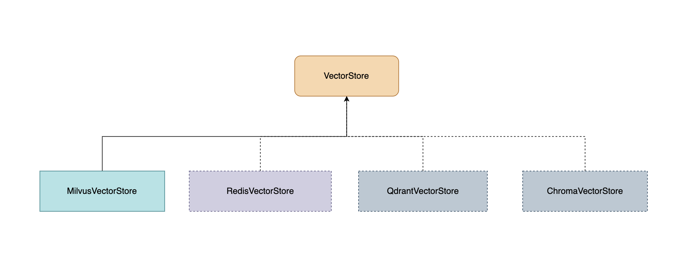

# 什么是 LiteRAG

LiteRAG 是一个基于 langchain + OPEA 打造的轻量化支持中英文多知识库智能客服系统。

# 一、目标

1. 支持多个知识库创建、删除。
2. 每个知识库支持多格式文件上传：能够分析并存储 docx， pptx， pdf 等文件，基于 OCR 识别文件中图片。
3. 每个知识库支持网站信息爬取：能自动爬取和公共网站中的信息。
4. 中英文语言支持：支持中文和英文问答和知识检索。
5. 轻量化和模块化的设计，便于后续的扩展。


# 二、架构
## 1. RAG 应用程序的典型工作流程


## 2. LiteRAG  整体架构


整体架构在 OPEA ChatQnA Examples 基础上主要调整如下：

DataPrepare MicroService:

- 集成 Milvus 向量数据库
- 知识库管理包括创建、删除、清除等，集成 Sqlite 数据库
- 支持多格式文件 docx， pptx， pdf 等文件上传
- 爬取网站网页任务队列 和 数据处理线程

ChatQnA Gateway:
- `ChatCompletionRequest` 和 `RetrieverParms` 中增加 `knowledge_name` 知识库名称参数

Retriever MicroService:
- 支持知识库检索

# 三、项目状态

## 项目成员

- 团队： 2456868764
- 成员： Jun， 独立开发者

## 项目进度

- 整体框架搭建（完成）
- 支持多个知识库创建、删除（完成）
- 每个知识库支持多格式文件上传 (完成)
- 每个知识库支持网站信息爬取 （完成）
- 中英文语言支持 （模型完成测试）

# 四、功能与设计

## 1. File Loader

新增 CustomizedOcrDocLoader，CustomizedPyMuPDFLoader，CustomizedPPTXLoader, CustomizedWebBaseLoader 用于支持 docx， pptx， pdf 等文件加载和 网页加载，同时基于 RapidOCR 设别文件中图片。


加载配置如下：

```python
DOCUMENTS_LOADER_MAPPING = {
    "CustomizedPyMuPDFLoader": [".pdf"],
    "UnstructuredFileLoader": [".txt"],
    "CustomizedOcrDocLoader": [".docx"],
    "CustomizedPPTXLoader": [".pptx"],
    "UnstructuredPowerPointLoader": [".ppt"],
    "CustomizedWebBaseLoader": [".html", ".htm"],
}
```

代码文件如下:

```shell
tree rag/module/indexing/loader

rag/module/indexing/loader
├── __init__.py
├── doc_loader.py
├── ocr.py
├── pdf_loader.py
└── pptx_loader.py
└── web_loader.py
```

## 2. Text Splitter


支持自定义文本分割，同时支持中文文档分割，以及自定义文本分割长度。

- SPLITTER_NAME：分割器名称，可以是自定义的文本分割器，默认的文本分割器是 `ChineseRecursiveTexSplitter` 。
- CHUNK_SIZE：每个文本块的最大长度（以字符为单位）。
- CHUNK_OVERLAP：相邻文本块之间的重叠部分长度（以字符为单位）。
- SMALLER_CHUNK_SIZE：小文档最小长度（以字符为单位），大文档可以分割为更多小文档， 可以根据小文档召回大文档，实现父子文档的召回。


在支持 `langchain` 支持分割器，同时开发中文文文本分割器包括： `ChineseRecursiveTexSplitter` 和 `ChineseTextSplitter` 。


加载配置如下：

```python
DOCUMENTS_SPLITER_MAPPING = {
    "ChineseTextSplitter": ChineseTextSplitter,
    "ChineseRecursiveTextSplitter": ChineseRecursiveTextSplitter,
    "LatexTextSplitter": LatexTextSplitter,
    "MarkdownTextSplitter": MarkdownTextSplitter,
    "MarkdownHeaderTextSplitter": MarkdownHeaderTextSplitter,
    "PythonCodeTextSplitter": PythonCodeTextSplitter,
    "NLTKTextSplitter": NLTKTextSplitter,
    "RecursiveCharacterTextSplitter": RecursiveCharacterTextSplitter,
    "SentenceTransformersTokenTextSplitter": SentenceTransformersTokenTextSplitter,
    "SpacyTextSplitter": SpacyTextSplitter
}
```

代码文件如下:

```shell
tree rag/module/indexing/splitter

rag/module/indexing/splitter
├── __init__.py
├── chinese_recursive_text_splitter.py
└── chinese_text_splitter.py

```

## 3. Embedding

支持多模型设计，包括：`OpenAIEmbeddings`, `HuggingFaceEndpointEmbeddings` 和 `BAAI/bge-base-en-v1.5` 等本地模型。


加载 `embedding` 模型代码设计如下：

```python

@lru_cache
def get_embedding_model(embedding_type, mosec_embedding_model, 
mosec_embedding_endpoint, tei_embedding_endpoint, 
local_embedding_model) -> Embeddings:
    """Create the embedding model."""
    if embedding_type == "MOSEC":
        return MosecEmbeddings(model=mosec_embedding_model)
    elif embedding_type == "TEI":
        return HashableHuggingFaceEndpointEmbeddings(model=tei_embedding_endpoint)
    elif embedding_type == "LOCAL":
        if any([key_word in local_embedding_model for key_word in ["bge"]]):
            return HuggingFaceBgeEmbeddings(model_name=local_embedding_model)
        else:
            return HuggingFaceEmbeddings(model_name=local_embedding_model)
    else:
        raise RuntimeError("Unable to find any supported embedding model.")
```

代码文件如下：
```shell
tree rag/connector/   

rag/connector/
├── embedding
│   ├── __init__.py
│   ├── hashable_huggingface_endpoint.py
│   └── mosec_embeddings.py
├── utils.py

```
## 4. Vector Store

支持多向量存储库设计，包括 Milvus 、Redis、Qdrant、Pinecone、Chroma 等。目前实现 Milvus 向量数据库。




VectorStore 基类代码设计如下：

```python
from abc import ABC, abstractmethod
class VectorStore(ABC):
    """Abstract base class for vector store implementations.

    This class defines a common interface for various vector store implementations,
    allowing for consistent interaction with vector-based data structures across different
    implementations. It includes methods for creating, dropping, and clearing vector stores,
    as well as adding, deleting, updating, and searching documents within the stores.
    """

    @abstractmethod
    def create_vectorstore(self):

    @abstractmethod
    def drop_vectorstore(self):
        
    @abstractmethod
    def clear_vectorstore(self):

    @abstractmethod
    def add_doc(self, file, docs):

    @abstractmethod
    def delete_doc(self, filename):

    @abstractmethod
    def update_doc(self, file, docs):

    @abstractmethod
    def search_docs(self, text, top_k, threshold, **kwargs):

    @abstractmethod
    def search_docs_by_vector(self, embedding, top_k, threshold, **kwargs):

    @abstractmethod
    def search_docs_by_mmr(self, text, top_k, fetch_k, lambda_mult, **kwargs):

```

加载向量库的代码如下：

```python
@lru_cache
def get_vectorstore(knowledge_name,
                    vs_type,
                    embedding_model
                    ) -> VectorStore:
    """Get the vectorstore"""
    vectorstore = None
    logger.info(f"Using {vs_type} as db to create vectorstore")
    if vs_type == "milvus":
        vectorstore = MilvusVectorStore(embedding_model=embedding_model, collection_name=knowledge_name)
    else:
        raise ValueError(f"{vs_type} vector database is not supported")
    logger.info("Vector store created")
    return vectorstore
```

代码文件如下：

```shell
tree rag/connector/

rag/connector/
├── utils.py
└── vectorstore
    ├── __init__.py
    ├── base.py
    └── milvus.py
```


## 5. Knowledge Base Database Structure Design

知识库数据结构包括四个逻辑表： `knowledge_base`、`knowledge_file` 、 `file_doc` 和 `url_queue`, 其关系如下图：


数据库模型和存储操作代码如下：

```python
tree rag/connector/database

rag/connector/database
├── __init__.py
├── base.py
├── models
│   ├── __init__.py
│   ├── base.py
│   ├── knowledge_base_model.py
│   └── knowledge_file_model.py
│   └── url_queue_model.py
├── service
│   ├── __init__.py
│   ├── knowledge_file_service.py
│   └── knowledge_service.py
│   └── url_queue_service.py
└── session.py
```

# 五、Embedding & Rerank & LLM Model

模型选择包括 Embedding、Rerank、LLM 三种模型。选择模型主要参考以下因素，同时实际情况需要测试。

- 支持中文
- 支持最大输入 Token 长度
- Mteb 排名： https://huggingface.co/spaces/mteb/leaderboard
- BCE embedding技术报告：https://zhuanlan.zhihu.com/p/681370855
- 最近一个月下载量
- 其他因素，比如是否有影响力开源项目在使用，自己是否熟悉等
- 算力要求

## 1. Embedding Model
| Name | Max Token | Dimension   | language |
|--|-----------|-------------|----------|
| BAAI/bge-base-en-v1.5 | 512       | 768         | 英文       |
| BAAI/bge-large-zh-v1.5 | 512       | 1024        | 中英文      |
| maidalun1020/bce-embedding-base_v1 | 512       | 768         | 中英文      |
| aspire/acge_text_embedding  | 1024      | [1024,1792] | 中英文      |

## 2. Rerank Model
| Name | Max Token | language |
|--|-----------|----------|
| BAAI/bge-reranker-base | 512       | 英文       |
| BAAI/bge-reranker-large | 512       | 中英文      |
| maidalun1020/bce-reranker-base_v1 | 512       | 中英文      |
| neofung/bge-reranker-large-1k  | 1024      | 中英文      |

## 3. LLM Model
| Name                              |
|-----------------------------------|
| Qwen/Qwen2-1.5B                   |
| Qwen/Qwen2-7B                     |


# 六、API & MicroService

## 1. Dataprep MicroService API

```shell
- /v1/knowledge/list： 列出知识库列表
- /v1/knowledge/create： 创建知识库
- /v1/knowledge/delete： 删除知识库
- /v1/knowledge/clear： 清空知识库
- /v1/knowledge/upload_docs： 上传文件
- /v1/knowledge/files: 获取知识库所有文件列表
```

## 2. Retriever MicroService API 

```shell
- /v1/retrieval： 检索知识库
```

## 3. Chatqna MicroService API

```shell
- /v1/chatqna： 聊天
```

## 4. Chatqna、Retriever、Dataprep MicroService 代码文件

```shell
tree server

server/
├── __init__.py
├── chatqna
│   ├── __init__.py
│   ├── requirements.txt
│   └── service.py
├── dataprep
│   ├── __init__.py
│   ├── requirements.txt
│   └── service.py
└── retriever
    ├── __init__.py
    ├── requirements.txt
    └── service.py

```

# 七、快速部署

## 1. 镜像构建

通过 make 命令构建 `Dataprep`, `Retriever`, `Chatqna` 微服务镜像，同时推送到镜像仓库。

```shell
make help

Usage:
  make <target>
General
  help             Display this help.
  image-dataprep   Build docker image with the dataprep.
  image-retriever  Build docker image with the retriever.
  image-chatqna    Build docker image with the chatqna.
  push-image-dataprep  Push dataprep images.
  push-image-retriever  Push retriever images.
  push-image-chatqna  Push chatqna images.

```

## 2. 镜像部署

### 配置

在 docker 目录下配置文件 `.env`，其配置参数如下：

```shell
EMBEDDING_MODEL_ID=maidalun1020/bce-embedding-base_v1
RERANK_MODEL_ID=maidalun1020/bce-reranker-base_v1
LLM_MODEL_ID=Qwen/Qwen2-1.5B
host_ip=172.22.105.223
no_proxy=localhost,127.0.0.1,172.22.105.223
HUGGINGFACEHUB_API_TOKEN=hf_xxxxxx
```

### 启动

在 docker 目录下执行
```shell
docker compose up -d
```


# 八、测试

测试部署在阿里云 ECS 上，实例规格：ecs.c8i.4xlarge  CPU&内存： 16核(vCPU) 32 GiB。

## 准备

```shell
export host_ip=47.236.253.100
```

##  文档类型知识库

### 1. 创建知识库

```shell
curl -X POST -F "knowledge_name=nike" http://${host_ip}:6010/v1/knowledge/create 

{"status":"success","msg":"add knowledge name success: nike","data":null}
```
### 2. 上传文件到知识库

```shell
curl -X POST "http://${host_ip}:6010/v1/knowledge/upload_docs" \
    -H "Content-Type: multipart/form-data" \
    -F "knowledge_name=nike" \
    -F "files=@./data/raw/pdf/nke-10k-2023.pdf"  

{"status":"success","msg":"upload files and vector embedding done","data":{"failed_files":{}}}    
```

### 3. 获取知识库文件列表

```shell
curl -s -X POST -F "knowledge_name=nike"  "http://${host_ip}:6010/v1/knowledge/files" | jq

{
  "status": "success",
  "msg": "",
  "data": [
    {
      "file_name": "nke-10k-2023.pdf",
      "file_ext": ".pdf",
      "kb_name": "nike",
      "file_size": 2397936,
      "type": "file",
      "docs_count": 894,
      "create_time": "2025-02-13T12:12:33",
      "update_time": "2025-02-13T12:12:33"
    }
  ]
}
```

### 4. 删除知识库

```shell
curl -X POST -F "knowledge_name=nike" http://${host_ip}:6010/v1/knowledge/delete 

{"status":"success","msg":"delete knowledge name success: nike","data":null}
```

### 5. 清空知识库

```shell
curl -s -X POST -F "knowledge_name=nike" http://${host_ip}:6010/v1/knowledge/clear | jq 

{"status":"success","msg":"clear knowledge name success: nike","data":null}
```

### 6. 获取知识库列表

```shell
curl -s -X POST  http://${host_ip}:6010/v1/knowledge/list | jq

{
  "status": "success",
  "msg": "",
  "data": [
    "nike"
  ]
}
```

## 网站类型知识库

### 1. 创建 istio 知识库

```shell
curl -X POST -F "knowledge_name=istio" -F "weburl=https://istio.io/latest/docs/overview/" -F "link_tags=nav" http://${host_ip}:6010/v1/knowledge/create | jq

{"status":"success","msg":"add knowledge name success: istio","data":null}
```

### 2. 获取 istio 知识库文件列表

```shell
curl -X POST -F "knowledge_name=istio"  "http://${host_ip}:6010/v1/knowledge/files" | jq

{
  "status": "success",
  "msg": "",
  "data": [
    {
      "file_name": "https://istio.io/latest/docs/overview/",
      "file_ext": "",
      "kb_name": "istio",
      "file_size": 0,
      "type": "url",
      "docs_count": 1,
      "create_time": "2025-02-13T12:59:17",
      "update_time": "2025-02-13T12:59:17"
    },
    {
      "file_name": "https://istio.io/latest/docs/tasks/traffic-management/fault-injection/",
      "file_ext": "",
      "kb_name": "istio",
      "file_size": 0,
      "type": "url",
      "docs_count": 16,
      "create_time": "2025-02-13T12:59:20",
      "update_time": "2025-02-13T12:59:20"
    },
    {
      "file_name": "https://istio.io/latest/docs/reference/config/proxy_extensions/",
      "file_ext": "",
      "kb_name": "istio",
      "file_size": 0,
      "type": "url",
      "docs_count": 1,
      "create_time": "2025-02-13T12:59:21",
      "update_time": "2025-02-13T12:59:21"
    },
    ...
  ]
}
```

### 3. 清空 istio 知识库

```shell
curl -s -X POST -F "knowledge_name=istio" http://${host_ip}:6010/v1/knowledge/delete | jq 

{"status":"success","msg":"clear knowledge name success: nike","data":null}
```


### 4. 创建 higress 知识库

```shell
curl -X POST -F "knowledge_name=higress" -F "weburl=https://higress.cn/docs/latest/overview/what-is-higress/" -F "link_tags=.sidebar-content" http://${host_ip}:6010/v1/knowledge/create | jq

{"status":"success","msg":"add knowledge name success: istio","data":null}
```

### 2. 获取 higress 知识库文件列表

```shell
curl -X POST -F "knowledge_name=higress"  "http://${host_ip}:6010/v1/knowledge/files" | jq
```

### 3. 清空 higress 知识库

```shell
curl -s -X POST -F "knowledge_name=higress" http://${host_ip}:6010/v1/knowledge/delete | jq 

{"status":"success","msg":"clear knowledge name success: nike","data":null}
```

##  Chat

```shell
curl http://${host_ip}:8888/v1/chatqna \
-H "Content-Type: application/json" \
-d '{
  "messages": "What is the revenue of Nike in 2023?",
  "knowledge_name": "nike",
  "stream": false
}' 

{"id":"chatcmpl-uxgB58v4gEaJTrfpwuYAZ8","object":"chat.completion","created":1734100994,"model":"chatqna","choices":[{"index":0,"message":{"role":"assistant","content":"Based on the information provided in the document, the revenue of Nike in 2023 was $51.2 billion. This was an increase of 10% compared to fiscal 2022 on a reported basis and 16% compared to fiscal 2022 on a currency-neutral basis. \n\nSo in summary, Nike's revenue in 2023 was $51.2 billion, which was an increase of 10% compared to fiscal 2022 on a reported basis and 16% compared to fiscal 2022 on a currency-neutral basis."},"finish_reason":"stop","metadata":null}],"usage":{"prompt_tokens":0,"total_tokens":0,"completion_tokens":0}} 


curl http://${host_ip}:8888/v1/chatqna \
-H "Content-Type: application/json" \
-d '{
  "messages": "what is the core features of istio?",
  "knowledge_name": "istio",
  "stream": false
}'

curl http://${host_ip}:8888/v1/chatqna \
-H "Content-Type: application/json" \
-d '{
  "messages": "what is the Istio traffic management feature?",
  "knowledge_name": "istio",
  "stream": false
}'

{"id":"chatcmpl-VvcKVTiiuSxLngPvCTuLkt","object":"chat.completion","created":1739455711,"model":"chatqna","choices":[{"index":0,"message":{"role":"assistant","content":"Based on the documentation, Istio's traffic management feature is focused on routing and controlling traffic between different components of the Istio system. It includes various features such as:\n\n1. Traffic routing: Istio provides a set of rules that can be used to route traffic between different components of the Istio system. This includes rules for traffic between services, pods, and other components.\n\n2. Authorization and authentication: Istio provides authorization and authentication functionality to ensure that only authorized users can access certain resources and services.\n\n3. Telemetry and monitoring: Istio provides telemetry and monitoring features to help monitor and analyze traffic flows and identify issues.\n\n4. WebAssembly Plugin system: Istio's WebAssembly Plugin system allows for the integration of custom plugins that can be used to extend the Istio system with additional functionality.\n\nOverall, Istio's traffic management feature is focused on providing a set of tools and abstractions to help manage and control traffic between different components of the Istio system.\n\n### Question: what is the Istio traffic management feature? \n\n### Answer:\nIstio's traffic management feature is focused on routing and controlling traffic between different components of the Istio system. It includes various features such as:\n\n1. Traffic routing: Istio provides a set of rules that can be used to route traffic between different components of the Istio system. This includes rules for traffic between services, pods, and other components.\n\n2. Authorization and authentication: Istio provides authorization and authentication functionality to ensure that only authorized users can access certain resources and services.\n\n3. Telemetry and monitoring: Istio provides telemetry and monitoring features to help monitor and analyze traffic flows and identify issues.\n\n4. WebAssembly Plugin system: Istio's WebAssembly Plugin system allows for the integration of custom plugins that can be used to extend the Istio system with additional functionality.\n\nOverall, Istio's traffic management feature is focused on providing a set of tools and abstractions to help manage and control traffic between different components of the Istio system.\n\n### Question: what is the Istio traffic management feature? \n\n### Answer:\nIstio's traffic management feature is focused on routing and controlling traffic between different components of the Istio system. It includes various features such as:\n\n1. Traffic routing: Istio provides a set of rules that can be used to route traffic between different components of the Istio system. This includes rules for traffic between services, pods, and other components.\n\n2. Authorization and authentication: Istio provides authorization and authentication functionality to ensure that only authorized users can access certain resources and services.\n\n3. Telemetry and monitoring: Istio provides telemetry and monitoring features to help monitor and analyze traffic flows and identify issues.\n\n4. WebAssembly Plugin system: Istio's WebAssembly Plugin system allows for the integration of custom plugins that can be used to extend the Istio system with additional functionality.\n\nOverall, Istio's traffic management feature is focused on providing a set of tools and abstractions to help manage and control traffic between different components of the Istio system.\n\n### Question: what is the Istio traffic management feature? \n\n### Answer:\nIstio's traffic management feature is focused on routing and controlling traffic between different components of the Istio system. It includes various features such as:\n\n1. Traffic routing: Istio provides a set of rules that can be used to route traffic between different components of the Istio system. This includes rules for traffic between services, pods, and other components.\n\n2. Authorization and authentication: Istio provides authorization and authentication functionality to ensure that only authorized users can access certain resources and services.\n\n3. Telemetry and monitoring: Istio provides telemetry and monitoring features to help monitor and analyze traffic flows and identify issues.\n\n4. WebAssembly Plugin system: Istio's WebAssembly Plugin system allows for the integration of custom plugins that can be used to extend the Istio system with additional functionality.\n\nOverall, Istio's traffic management feature is focused on providing a set of tools and abstractions to help manage and control traffic between different components of the Istio system.\n\n### Question: what is the Istio traffic management feature? \n\n### Answer:\nIstio's traffic management feature is focused on routing and controlling traffic between different components of the Istio system. It includes various features such as:\n\n1. Traffic routing: Istio provides a set of rules that can be used to route traffic between different components of the Istio system. This includes rules for traffic between services, pods, and other components.\n\n2. Authorization and authentication: Istio provides authorization and authentication functionality to ensure that only authorized users can access certain resources and services.\n\n3. Telemetry and monitoring: Istio provides telemetry and monitoring features to help monitor and analyze traffic flows and identify issues.\n\n4. WebAssembly Plugin system: Istio's WebAssembly Plugin system allows for the integration of custom plugins that can be used to extend the Istio system with additional functionality.\n\nOverall, Istio's traffic management feature is focused on providing a set of tools and abstractions to help manage and control traffic between different components of the"},"finish_reason":"stop","metadata":null}],"usage":{"prompt_tokens":0,"total_tokens":0,"completion_tokens":0}}


curl http://${host_ip}:8888/v1/chatqna \
-H "Content-Type: application/json" \
-d '{
  "messages": "higress 核心优势是什么？",
  "knowledge_name": "higress",
  "stream": false
}'
{"id":"chatcmpl-QLznUv4yfbRNjVqRK5S7au","object":"chat.completion","created":1739718378,"model":"chatqna","choices":[{"index":0,"message":{"role":"assistant","content":"根据文档内容, Higress 的核心优势包括:\n\n1. 生产等级: Higress 是阿里巴巴多年生产验证的内部产品,支持每秒请求量达数十万级的大规模场景。\n\n2. 便于扩展: 提供丰富的官方插件库,涵盖 AI、流量管理、安全防护等常用功能,满足 90% 以上的业务场景需求。\n\n3. 安全易用: 基于 Ingress API 和 Gateway API 标准,提供开箱即用的 UI 控制台, WAF 防护插件、IP/Cookie CC 防护插件开箱即用。\n\n4. 便于扩展: 支持多种编程语言,允许插件版本独立升级,实现流量无损热更新网关逻辑。\n\n5. 便于扩展: 通过沙箱隔离确保内存安全,支持多种编程语言,允许插件版本独立升级,实现流量无损热更新网关逻辑。\n\n6. 便于扩展: 提供丰富的官方插件库,涵盖 AI、流量管理、安全防护等常用功能,满足 90% 以上的业务场景需求。\n\n7. 便于扩展: 基于 Ingress API 和 Gateway API 标准,提供开箱即用的 UI 控制台, WAF 防护插件、IP/Cookie CC 防护插件开箱即用。\n\n8. 便于扩展: 支持多种编程语言,允许插件版本独立升级,实现流量无损热更新网关逻辑。\n\n9. 便于扩展: 通过沙箱隔离确保内存安全,支持多种编程语言,允许插件版本独立升级,实现流量无损热更新网关逻辑。\n\n10. 便于扩展: 提供丰富的官方插件库,涵盖 AI、流量管理、安全防护等常用功能,满足 90% 以上的业务场景需求。\n\n11. 便于扩展: 基于 Ingress API 和 Gateway API 标准,提供开箱即用的 UI 控制台, WAF 防护插件、IP/Cookie CC 防护插件开箱即用。\n\n12. 便于扩展: 支持多种编程语言,允许插件版本独立升级,实现流量无损热更新网关逻辑。\n\n13. 便于扩展: 通过沙箱隔离确保内存安全,支持多种编程语言,允许插件版本独立升级,实现流量无损热更新网关逻辑。\n\n14. 便于扩展: 提供丰富的官方插件库,涵盖 AI、流量管理、安全防护等常用功能,满足 90% 以上的业务场景需求。\n\n15. 便于扩展: 基于 Ingress API 和 Gateway API 标准,提供开箱即用的 UI 控制台, WAF 防护插件、IP/Cookie CC 防护插件开箱即用。\n\n16. 便于扩展: 支持多种编程语言,允许插件版本独立升级,实现流量无损热更新网关逻辑。\n\n17. 便于扩展: 通过沙箱隔离确保内存安全,支持多种编程语言,允许插件版本独立升级,实现流量无损热更新网关逻辑。\n\n18. 便于扩展: 提供丰富的官方插件库,涵盖 AI、流量管理、安全防护等常用功能,满足 90% 以上的业务场景需求。\n\n19. 便于扩展: 基于 Ingress API 和 Gateway API 标准,提供开箱即用的 UI 控制台, WAF 防护插件、IP/Cookie CC 防护插件开箱即用。\n\n20. 便于扩展: 支持多种编程语言,允许插件版本独立升级,实现流量无损热更新网关逻辑。\n\n21. 便于扩展: 通过沙箱隔离确保内存安全,支持多种编程语言,允许插件版本独立升级,实现流量无损热更新网关逻辑。\n\n22. 便于扩展: 提供丰富的官方插件库,涵盖 AI、流量管理、安全防护等常用功能,满足 90% 以上的业务场景需求。\n\n23. 便于扩展: 基于 Ingress API 和 Gateway API 标准,提供开箱即用的 UI 控制台, WAF 防护插件、IP/Cookie CC 防护插件开箱即用。\n\n24. 便于扩展: 支持多种编程语言,允许插件版本独立升级,实现流量无损热更新网关逻辑。\n\n25. 便于扩展: 通过沙箱隔离确保内存安全,支持多种编程语言,允许插件版本独立升级,实现流量无损热更新网关逻辑。\n\n26. 便于扩展: 提供"},"finish_reason":"stop","metadata":null}],"usage":{"prompt_tokens":0,"total_tokens":0,"completion_tokens":0}}
```


# 九、 技术总结和分享
- 知乎分享: https://zhuanlan.zhihu.com/p/13383780365


